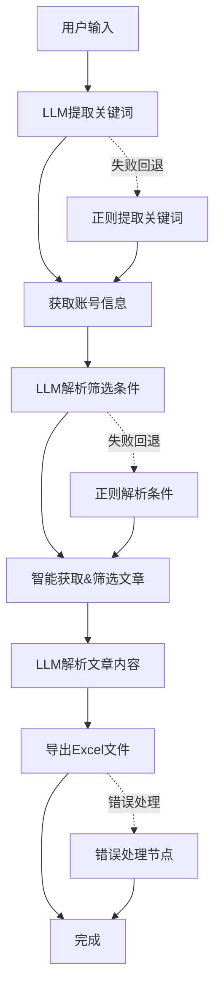

# 微信公众号文章收集工具

基于 LangGraph 的微信公众号文章收集和分析工具，集成了先进的LLM智能理解能力，可以自动获取指定公众号的文章，进行智能筛选，并使用大模型解析文章内容为结构化短新闻。

## 🚀 核心特性

1. **🤖 LLM驱动的智能理解**：使用OpenAI GPT模型理解复杂自然语言，准确提取公众号名称和筛选条件
2. **🔄 智能回退机制**：LLM解析失败时自动回退到正则表达式方法，确保系统稳定性
3. **📱 精准公众号搜索**：通过wxdown.online API精确搜索微信公众号信息
4. **📄 动态智能获取**：根据筛选条件动态调整获取策略，避免无效API调用
5. **🔍 多维度智能筛选**：支持标题关键词、文章数量、发布时间等多种筛选条件
6. **🧠 深度内容解析**：使用LLM将完整文章智能拆分为多个独立的短新闻条目
7. **📊 结构化Excel导出**：将结果保存到格式化的Excel文件，便于后续分析

## 🎯 技术亮点

### 🧠 双重解析引擎
- **LLM主引擎**：使用OpenAI GPT模型进行智能语义理解
- **正则回退引擎**：当LLM不可用时自动切换到正则表达式解析
- **置信度评估**：LLM返回解析置信度，确保结果可靠性

### 🔄 智能工作流管理
- **LangGraph编排**：使用状态图管理复杂工作流程
- **动态条件路由**：根据执行结果动态选择下一步操作
- **完整错误处理**：每个节点都有错误捕获和恢复机制

### 📊 高效数据处理
- **智能分页策略**：根据筛选条件动态调整获取页数
- **实时条件过滤**：边获取边筛选，提高处理效率
- **批量LLM解析**：优化API调用，降低处理成本

### 📝 支持复杂自然语言输入
```bash
✅ "请查询银行科技研究社的文章，筛选最近的20篇，标题包含'AI'或'人工智能'"
✅ "我想看科技日报关于区块链的报道，要最新的10篇"  
✅ "帮我收集创业邦发布的包含数字化转型内容的文章，数量不超过15篇"
✅ "搜索腾讯研究院在2024年1月到3月期间发布的技术报告"
✅ "查找最近一周关于ChatGPT的技术分析文章，不超过8篇"
```

## 📦 环境要求

- **Python**: >=3.12
- **依赖管理**: uv (推荐) 或 pip
- **API服务**: wxdown.online API token
- **LLM服务**: OpenAI API 或兼容接口

## 🛠️ 安装依赖

### 使用 uv (推荐)
```bash
# 安装 uv (如果未安装)
curl -LsSf https://astral.sh/uv/install.sh | sh

# 安装项目依赖
uv sync
```

### 使用 pip
```bash
pip install -r requirements.txt
```

## ⚙️ 环境配置

### 1. 创建配置文件
```bash
# 复制示例配置文件
cp .env.example .env
```

### 2. 配置环境变量
编辑 `.env` 文件，设置以下参数：

```env
# OpenAI API 配置 (必需)
OPENAI_API_KEY=your-openai-api-key-here
OPENAI_BASE_URL=https://api.openai.com/v1  # 可选，支持其他兼容API
OPENAI_MODEL=gpt-3.5-turbo  # 可选，默认为gpt-3.5-turbo

# wxdown.online API 配置 (内置)
# API_TOKEN=your-wxdown-api-token  # 如需自定义
```

### 3. API服务说明
- **OpenAI API**: 用于智能语义理解和内容解析
- **wxdown.online**: 用于获取微信公众号数据 (已内置token)
- **备用模式**: LLM不可用时自动切换到正则解析模式

## 🚀 使用方法

### 1. 交互式运行 (推荐)
```bash
# 启动交互式界面
uv run python main.py

# 然后输入自然语言查询，例如：
# "请查询银行科技研究社的文章，筛选最近的20篇，标题包含'AI'"
```

### 2. 程序化调用
```python
from workflow import run_workflow

# 支持复杂的自然语言输入
user_input = "请查询银行科技研究社的文章，筛选最近的20篇文章，标题包含'人工智能'或'AI'"
result = run_workflow(user_input)

# 检查结果
if result.get("error_message"):
    print(f"处理失败: {result['error_message']}")
else:
    print(f"成功处理，Excel文件: {result['excel_file_path']}")
    print(f"处理统计: 总文章{len(result['all_articles'])}篇，" 
          f"筛选后{len(result['filtered_articles'])}篇，"
          f"短新闻{len(result['short_news_list'])}条")
```

### 3. 直接运行工作流测试
```bash
# 运行内置测试用例
uv run python workflow.py
```

## 输入格式示例

- `"请查询银行科技研究社的文章，筛选最近的20篇"`
- `"搜索科技日报公众号，标题包含人工智能的文章，最多10篇"`
- `"查询创业邦的文章，2024年1月1日到2024年3月31日的文章"`

## 🔄 智能工作流程

### 工作流架构图


### 详细流程说明

1. **🧠 LLM智能关键词提取**
   - 使用GPT模型理解自然语言输入
   - 提取公众号名称和相关关键词
   - 失败时自动回退到正则表达式方法

2. **🔍 公众号信息获取**
   - 通过wxdown.online API搜索匹配的公众号
   - 获取fake_id等关键信息用于文章检索

3. **📊 LLM智能条件解析**
   - 解析复杂的筛选条件(关键词、数量、时间等)
   - 支持相对时间表达("最近30天"、"本月"等)
   - 智能理解用户意图并转换为结构化条件

4. **📄 动态智能文章获取**
   - 根据筛选条件动态决定获取页数
   - 实时筛选，满足条件即停止获取
   - 设置最大页数保护，防止无限循环

5. **🧠 深度内容解析**
   - 使用LLM将每篇文章解析为多个短新闻
   - 提取关键信息、去除无关内容
   - 生成结构化的新闻条目

6. **📊 结构化数据导出**
   - 生成包含详细信息的Excel文件
   - 自动错误处理和异常恢复
   - 保存完整的处理统计信息

## 输出文件

结果会保存在 `output/` 目录下，文件名格式：`wechat_articles_{公众号}_{时间戳}.xlsx`

Excel 文件包含以下字段：
- 序号
- 短新闻标题
- 完整内容
- 原始文章链接
- 创建时间

## 📁 项目结构

```
wechat-article-collect/
├── main.py                     # 🎯 主程序入口，交互式界面
├── workflow.py                 # 🔄 LangGraph工作流定义和编排
├── workflow_state.py           # 📊 工作流状态模型和数据结构
├── llm_extraction_nodes.py     # 🧠 LLM智能提取节点(关键词、条件解析)
├── workflow_nodes.py           # ⚙️ 基础工作流节点(搜索、获取、筛选)
├── llm_nodes.py               # 🤖 LLM内容解析节点(文章转短新闻)
├── export_nodes.py            # 📊 数据导出和错误处理节点
├── api_request.py             # 🌐 wxdown.online API接口封装
├── config.py                  # ⚙️ 配置管理和环境变量处理
├── .env                       # 🔐 环境变量配置文件
├── .env.example              # 📝 配置文件模板
├── pyproject.toml            # 📦 项目依赖和元数据
├── uv.lock                   # 🔒 依赖锁定文件
├── output/                   # 📁 输出目录(Excel文件)
└── CLAUDE.md                 # 📋 Claude Code项目说明
```

### 核心模块说明

- **智能理解层**: `llm_extraction_nodes.py` - 负责自然语言理解和条件解析
- **数据获取层**: `workflow_nodes.py` + `api_request.py` - 负责公众号搜索和文章获取
- **内容处理层**: `llm_nodes.py` - 负责文章内容的智能解析和转换
- **工作流编排**: `workflow.py` - 使用LangGraph管理整个处理流程
- **用户界面**: `main.py` - 提供友好的交互式命令行界面